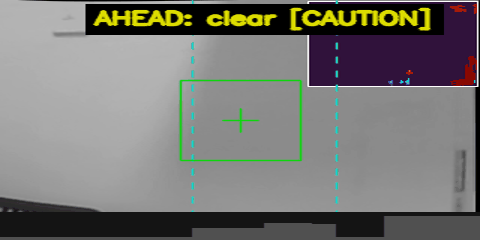

# Depth Perception Engine

A standalone, ROS-free stereo depth / geometric-evidence / obstacle
perception library. Deterministic, geometry-only — no object detection, no
learned models — built as the geometric perception provider for a UAV
navigating indoor environments, and designed to be embedded in any
consuming system (ROS2 node, simulator adapter, desk-test script) without
dragging in ROS, camera hardware, or a GUI.

**Current release: `v1.2.0` — dual-interface architecture; DPE algorithms
remain SOFTWARE/SIMULATION DEVELOPMENT FROZEN.**
See [Release Status](#release-status) below.



---

## What DPE Provides

```
Stereo pair (left, right — plain NumPy arrays)
        |
        v
Rectification (calibrated)              stereo.RectificationEngine
        |
        v
Disparity (SGBM)                        stereo.DisparityEngine
        |
        v
Metric depth                            depth.DepthEstimator
        |
        v
Reliability / validity                  quality.*, geometry.reliability
        |                               (garbage-frame check, shadow-zone /
        |                                ramp-zone contamination gating)
        v
Geometric evidence (opt-in, PipelineConfig)
        +-- obstacle cloud              geometry.build_obstacle_cloud
        +-- free-space rays             geometry.build_free_space_rays
        +-- surface evidence            geometry.surface
        +-- boundary evidence           geometry.boundary
        +-- opening evidence            geometry.opening
        +-- clearance evidence          geometry.provider
        |
        v
Temporal stabilization (opt-in, Level 4)
        history / consistency / stabilization / rotation
        compensation / motion-aware reliability / persistence
        |
        v
GeometryFrame — the one authoritative output contract
```

This is the repository's actual, current architecture — every stage above
is a real module under `src/depth_perception_engine/`, not an aspirational
diagram. `traversability.SceneInterpreter` (region grid + `NavigationDecision`)
and `obstacles.ThreatAssessor` (per-beam scan) are older, separately
maintained "Level 0-2" outputs, still real and tested, kept for backward
compatibility (`mp01_perception` consumes them today) — `GeometryFrame` is
the newer, final, complete evidence contract a new consumer should target.
See [Architecture](#architecture) for the full breakdown.

## Design Principles

Only principles demonstrably reflected in code or docs, not aspirational
marketing:

- **Deterministic.** Same input, same config → same output. No
  randomness anywhere in the algorithm path (benchmark fixtures use fixed
  seeds specifically so results are reproducible, not because the pipeline
  itself needs seeding).
- **ROS-free core.** Zero import of `rclpy`/`sensor_msgs`/`cv_bridge`
  anywhere under `src/` — enforced by `tests/test_no_ros_dependency.py`
  via static source scan, not just convention.
- **Bounded computation.** `TemporalHistory`/`TemporalPersistenceTracker`
  state is configured with hard bounds (`max_records`, fixed grid shape)
  and confirmed, by direct measurement over a 500-frame run, not to grow
  unbounded — see `docs/VALIDATION_REPORT.md`'s D14 addendum.
- **Explicit uncertainty, not fabricated certainty.** Invalid depth is
  `0.0`/masked, never a guessed value. `ClearanceEvidence.support_state`
  (`SUPPORTED`/`PARTIALLY_SUPPORTED`/`NO_EVIDENCE`) and
  `SurfaceEvidence.planarity` exist specifically so a consumer can weight
  evidence by confidence rather than trust a bare number blindly — see
  [Known Limitations](#known-limitations) for why this matters concretely.
- **Platform-independent library.** No camera driver, no simulator
  integration, no vehicle identity anywhere in `src/` — a caller supplies
  two NumPy arrays and a calibration; where those arrays came from
  (real hardware, Gazebo, a recorded file) is entirely the caller's concern.
- **Stable public contract.** `GeometryFrame`'s complete type graph is
  Tier 1 and structurally verified (`tests/test_public_api.py`), not a
  hand-maintained list — a new field typed against a non-public class fails
  that test automatically.

## Performance at a Glance

All figures below are measured, cited, and reproducible from this
repository — see [`docs/VALIDATION_MATRIX.md`](docs/VALIDATION_MATRIX.md)
for the full table with sources, and
[Validation Methodology](#validation-methodology) for what "synthetic" and
"dev-container" mean here.

| | v1.1.1 |
|---|---|
| Depth error @ 1 m / 2 m / 3 m / 5 m / 6 m (median, synthetic) | 0.405% / 0.561% / 1.018% / 0.561% / 3.574% |
| Observable-ROI valid fraction (synthetic) | 99.3-100% |
| Boundary precision / recall (synthetic) | 100% / 100% |
| Opening precision / recall (synthetic) | 100% / 90.9% |
| Surface-normal p95 angular error, high-planarity/full-coverage (synthetic) | 1.42° |
| Qualified clearance false-clear sectors (synthetic, 252-sector benchmark) | 0/252 |
| Standalone DPE latency, mean / p95 / p99 (320×240, dev container) | 38.4 ms / 45.9 ms / 52.2 ms |
| Standalone DPE throughput (mean-based) | 26.0 FPS |
| Regression suite | 953/953 passing |

Every one of these numbers is a **synthetic-fixture or dev-container**
measurement. None of them is a physical-hardware or Jetson-target
measurement — see [Hardware-Pending Validation](#known-limitations).

## Architecture

`src/depth_perception_engine/` module-by-module breakdown, the exact
per-frame pipeline call order, and the full public-API tier reference
(what's safe to import vs. internal):

- [`docs/PUBLIC_API.md`](docs/PUBLIC_API.md) — Tier 1/2/3 symbol reference
- [`docs/DPE_V1_PROVIDER_CONTRACT.md`](docs/DPE_V1_PROVIDER_CONTRACT.md) — the full `GeometryFrame` design record, phase by phase
- [`docs/DATA_CONTRACTS.md`](docs/DATA_CONTRACTS.md), [`docs/COORDINATE_FRAMES.md`](docs/COORDINATE_FRAMES.md), [`docs/CALIBRATION.md`](docs/CALIBRATION.md)
- [Project layout](#project-layout) below for the directory-level map

## Reliability Engineering

DPE's post-freeze `v1.0.1 → v1.1.1` history is a series of audits that each
found a real, measured gap and closed it with a geometric or
statistical-methodology fix — never by relaxing a validity gate or tuning a
threshold to make a specific fixture's number look better. Summary:

| Phase | Problem found | Fix | Result |
|---|---|---|---|
| I1 | SGBM smoothness penalty used the 3-channel constant on grayscale-only input | Corrected channel multiplier + `uniquenessRatio` 10→20 | Decorrelated false-valid disparity 41.8%→0.27% |
| I2 | "~60% whole-frame valid" was misread as reconstruction failure | Corrected metric scope (observable ROI, not whole frame) | 99.3-100% observable-ROI validity — no code change needed |
| I3 | Occlusion-shadow contamination read as high-confidence valid disparity | New geometric `compute_shadow_zone_mask` signal, threaded through Level 3/4 | ~13.6% contamination reduction |
| I4 | Low-support noise triggered false boundary positives | Boundary admission recalibrated to require real fractional support | Precision 87.8%→100%, recall unchanged at 100% |
| I5 | Opening spans spuriously split by dead-zone cells | Span-assembly merge/split logic fixed | Recall 54.5%→90.9%, precision unchanged at 100% |
| I5.1 | `ClearanceEvidence` magnitude error 13-94% in transition sectors | Root-caused (IQR+percentile aggregation); no safe accuracy fix found | Documented as an unresolved, characterized limitation |
| I6/I6.3 | 28/252 false-clear sectors found on re-audit | Benchmark-methodology bug fixed (24/28) + two reliability-gating signals closed the remaining 4 | 0/252 false-clear, worst `SUPPORTED` error 139%→4.4% |
| v1.1.1 | v1.1.0 packaging silently shipped an empty wheel under real build isolation | Explicit `setup.py` package declaration | Verified: isolated wheel, editable install, git-tag install |

Full before/after detail, rejected approaches, and root-cause investigation
for every row above:
**[`docs/ENGINEERING_EVOLUTION.md`](docs/ENGINEERING_EVOLUTION.md)**.

## Validation Methodology

- **Fixture families.** Controlled synthetic stereo pairs generated with
  known ground truth (target depth, plane orientation, gap width) —
  fronto-parallel/slanted planes, decorrelated noise, periodic patterns,
  occlusion/dis-occlusion steps, partial-coverage/mixed-surface cells,
  narrow obstacles, multi-zone scenes. See `benchmarks/*/fixtures.py`.
- **Deterministic seeds.** Every fixture sweep uses fixed seeds — results
  are exactly reproducible, not resampled noise averages.
- **Negative fixtures.** Pure decorrelated noise and single-step
  (non-opening) scenes are included specifically to measure false-positive
  rate, not just true-positive accuracy.
- **Regression testing.** `pytest tests/` (953 tests) plus
  `benchmarks/i0_baseline/compare_to_baseline.py`, which diffs every
  current metric against a recorded `v1.0.1` snapshot and reports every
  leaf-metric delta — nothing is silently allowed to regress unnoticed.
- **Benchmark provenance.** Every number in this README and
  `docs/VALIDATION_MATRIX.md` cites the exact script/artifact it came from.
  Benchmark result JSON is `.gitignore`d (regeneratable, not committed) —
  see `benchmarks/reporting/release_metrics_manifest.py` for the single
  place every headline metric is recomputed with its own citation.
- **Timing-boundary discipline.** "Standalone DPE latency" (this README,
  `docs/VALIDATION_MATRIX.md`) means `DepthPerceptionPipeline.process()`
  wall-clock time on a dev container, measured in isolation. It is a
  **different measurement boundary** from an external consumer's own
  end-to-end simulation/ROS/wrapper latency — the two are never compared
  directly in this repository's documentation. See
  `docs/ENGINEERING_EVOLUTION.md`'s baseline-provenance note.

## Known Limitations

Stated plainly, not softened for presentation — full detail and evidence
for each in [`docs/VALIDATION_MATRIX.md`](docs/VALIDATION_MATRIX.md) and
[`docs/ENGINEERING_EVOLUTION.md`](docs/ENGINEERING_EVOLUTION.md):

- **SGBM structural left-side search dead zone.** `numDisparities=128` on a
  320px frame makes the leftmost ~40% of columns structurally unable to
  produce disparity, regardless of scene content — a physical search-window
  limit, not a defect. Always scope validity metrics to the observable ROI,
  not the whole frame.
- **Weak-texture long-range depth degradation.** 6 m, weak-texture
  scenario: 5.296% median relative error — a real, harder case than other
  6 m scenarios, unresolved.
- **Clearance transition-sector magnitude limitation.** `ClearanceEvidence.
  nearest_distance_m` can still be 13-94% off in sectors overlapping a real
  depth transition or narrow obstacle — root-caused, no safe accuracy fix
  found. **Safety is separately closed** (0/252 false-clear on the
  qualified benchmark) — this is a magnitude-only, non-safety limitation.
- **Partial-coverage surface-normal degradation.** A grid cell with
  `support_fraction` well below 1.0 can report a large angular error
  (measured up to 81.5°) even at high self-reported `planarity` —
  `planarity` alone does not guarantee a correct normal direction.
- **Benchmark qualification is not a universal physical safety guarantee.**
  "0/252 false-clear" describes this qualified benchmark's own fixture
  population. An external integration independently found the same class
  of contamination on a scene outside that set — `ClearanceEvidence` is
  calibrated, gated evidence, not an unconditional guarantee for every
  possible scene. Combine it with `coverage_fraction`, temporal
  corroboration, and independent sensing.
- **Physical stereo-camera + Jetson validation remains future work.**
  Every metric in [Performance at a Glance](#performance-at-a-glance) is a
  synthetic-fixture or dev-container measurement. Level 3/4 have each been
  exercised against a real desk-test camera (see `docs/VALIDATION_REPORT.md`'s
  E7 and Level 4 addenda) but not the target Jetson hardware, and not under
  real physical motion for rotation-compensation accuracy — see
  `docs/LEVEL4_HARDWARE_VALIDATION_PENDING.md`.

## MP01 Integration

DPE's responsibility inside MP01 (or any consuming system) is **geometric
perception provider only**:

- **Input:** a rectified (or rectifiable) stereo pair, calibration, and
  optional short-window angular-rate evidence (`MotionHint`).
- **Output:** `GeometryFrame` — depth, obstacle/free-space geometry,
  surface/boundary/opening/clearance evidence, temporal state.
- **DPE does not:** perform semantic/object classification, own any
  ROS/topic/node logic, handle camera/IMU drivers, integrate with any
  specific simulator, hold vehicle/platform identity, run neural inference,
  perform localization or global mapping, or make any planning/control
  decision. Those responsibilities live in the sensor layer below DPE
  (`mp01_sensors` or equivalent) and the perception/planning system above
  it (a future `neural_perception_engine`/`hybrid_perception_engine` and
  beyond) — never in this repository.

Full release contract (INPUT/EXECUTION/AUTHORITATIVE-OUTPUT, owns/does-not-own):
[`docs/RELEASE_NOTES_V1.md`](docs/RELEASE_NOTES_V1.md).

**Which interface a consumer uses.** DPE exposes two, and they differ only in
how a valid input reaches the engine — both funnel into the same implementation
and both produce the same `GeometryFrame`:

```python
# CORE / EMBEDDED — what a consuming perception system should use.
from depth_perception_engine.core import (
    DepthPerceptionPipeline, PipelineConfig, StereoObservation, GeometryFrame,
)
pipeline = DepthPerceptionPipeline(config, calibration)          # construct once
geometry = pipeline.process_geometry_frame(observation)          # per frame

# STANDALONE — development, tests, benchmarks, physical qualification only.
from depth_perception_engine.standalone import StandaloneStereoInterface
dpe = StandaloneStereoInterface.from_calibration_file(path, config)
geometry = dpe.process_geometry_frame(left_image, right_image, timestamp=t)
```

A consuming system never constructs the standalone interface: it simply does not
import that subpackage, so the layer is structurally absent from its runtime
path rather than switched off by a mode flag. Full rationale, execution graph
and enforced invariants:
[`docs/DUAL_INTERFACE_ARCHITECTURE.md`](docs/DUAL_INTERFACE_ARCHITECTURE.md).

## Installation

```bash
python -m venv .venv && source .venv/bin/activate
pip install -e .              # library only — numpy + opencv-python-headless
pip install -e ".[dev]"       # + pytest/pytest-cov/pytest-mock, for running tests/
```

No camera, no display, and no ROS installation required for the library
itself. See [Running the examples](#running-the-examples) below for the
one extra step needed for the GUI demo.

**As a versioned dependency of another project**, install the built release
artifact instead of an editable checkout:

```bash
python -m build                                                # from a clone of this repo — produces dist/*.whl, dist/*.tar.gz
pip install /path/to/depth_perception_engine-1.1.1-py3-none-any.whl   # in the CONSUMING project's own environment
```

or directly from a tag:

```bash
pip install "git+https://github.com/Sayeed-Systems/depth-perception-engine.git@v1.1.1"
```

The installed wheel contains only the runtime package
(`depth_perception_engine/`) — no `tests/`, `docs/`, or `examples/`. See
[`docs/PUBLIC_API.md`](docs/PUBLIC_API.md) for exactly which symbols are
safe to import (Tier 1/2) versus internal (Tier 3, no stability guarantee).
`GeometryFrame` is the one authoritative output contract a larger external
system should consume.

### Development Setup

```bash
python3 -m venv .venv
source .venv/bin/activate
pip install --upgrade pip
pip install -e ".[dev]"
python -m pytest
```

`pip install -e ".[dev]"` installs the library in editable mode (src-layout
— edits under `src/depth_perception_engine/` are picked up immediately, no
reinstall needed) plus the full test toolchain: `pytest`, `pytest-cov`,
`pytest-mock`. `python -m pytest` runs the full suite (953 tests as of
`v1.1.1`) using this project's own `[tool.pytest.ini_options]`
configuration in `pyproject.toml`.

Other installable extras, same pattern:

```bash
pip install -e ".[docs]"      # reserved for a future docs build tool — currently installs nothing extra
pip install -e ".[viz]"       # matplotlib, for examples/visualize_level3.py and benchmarks/reporting/
pip install -e ".[all]"       # dev + docs + viz together
```

Coverage is available on demand (not enabled by default, to keep a plain
`pytest` run's output uncluttered):

```bash
pytest --cov=depth_perception_engine
```

## Minimal Usage

Every symbol below imports directly from the package root — this is the
canonical import style. Subpackage imports
(`from depth_perception_engine.pipeline import DepthPerceptionPipeline`)
still work as compatibility paths, but new code should use the top-level
form. Full API tier reference: [`docs/PUBLIC_API.md`](docs/PUBLIC_API.md).

```python
from depth_perception_engine import (
    DepthPerceptionPipeline,
    PipelineConfig,
    StereoObservation,
    load_stereo_calibration,
)

calibration = load_stereo_calibration("examples/config/stereo_calibration.xml")
pipeline = DepthPerceptionPipeline(PipelineConfig(), calibration)   # build once

result = pipeline.process(left_image, right_image)   # call per frame — both plain NumPy arrays
# or, if you're carrying a StereoObservation (e.g. with timestamps) instead
# of two loose arrays — an equivalent, not a different call shape:
observation = StereoObservation(left_image=left_image, right_image=right_image)
result = pipeline.process_observation(observation)

result.disparity_map          # float32 (H, W)
result.depth_map              # float32 (H, W), metres
result.valid_disparity_mask   # bool (H, W) — disparity_map > 0
result.valid_depth_mask       # bool (H, W) — depth_map > 0
result.traversability_mask    # TraversabilityResult: per-region grid + NavigationDecision
result.obstacles              # ObstacleAssessment: per-beam nearest-obstacle scan
result.confidence              # float, 0..1
result.processing_time_ms     # float
result.timestamp              # Optional[float] — only set if you pass left_timestamp/right_timestamp

# Level 3/4 (opt-in via PipelineConfig — see docs/DPE_V1_PROVIDER_CONTRACT.md):
result.geometry_frame          # Optional[GeometryFrame] — the final, authoritative evidence contract;
                                # None unless PipelineConfig(enable_geometry_frame=True)

pipeline.health()              # PipelineHealth: is_closed, frames_processed, last_confidence, ...
pipeline.reset()                # clears cross-frame smoothing state, keeps calibration/config
pipeline.close()                # marks the pipeline unusable; further process() calls raise
```

`from_config()` is also available as an alternate constructor, equivalent
to `DepthPerceptionPipeline(...)` above.

`pipeline.process_geometry_frame(observation)` returns the authoritative
`GeometryFrame` directly (never `None`) — that, not `result.geometry_frame`, is
the entry point a consuming perception system should use. `process()` above is a
convenience adapter that builds a `StereoObservation` from its loose arguments
and delegates to `process_observation()`, DPE's single geometry implementation.
See [`docs/DUAL_INTERFACE_ARCHITECTURE.md`](docs/DUAL_INTERFACE_ARCHITECTURE.md).

See [`examples/synthetic_demo.py`](examples/synthetic_demo.py) for this
same call shape run standalone (no camera).

### Pipeline (internal stage order)

```
(left_image, right_image) — already-split NumPy arrays, e.g. from ROS
  -> rectify (calibrated)                     stereo.RectificationEngine
  -> disparity (SGBM)                         stereo.DisparityEngine
  -> depth estimation                          depth.DepthEstimator
  -> 3D geometry (opt-in)                      geometry.PointCloudBuilder
  -> traversability grid + nav decision        traversability.SceneInterpreter
  -> per-beam obstacle scan                    obstacles.ThreatAssessor
  -> fused DepthPerceptionResult/GeometryFrame  fusion.result_builder
```

`pipeline.DepthPerceptionPipeline` wires all of the above and holds it
persistently across frames — this matters because `obstacles.ThreatAssessor`
EMA-smooths and debounces its output over time; rebuilding it every frame
throws that smoothing away. `pipeline.api` also exposes each stage as a
plain, stateless function (`compute_disparity`, `estimate_depth`,
`classify_traversability`, `detect_obstacles`, `process_stereo_pair`) for
one-shot use, scripting, or tests.

### Why geometry-only

Object detection (YOLO) was deliberately excluded, not just deferred as an
afterthought: obstacle avoidance only requires *where* something is, not
*what* it is, and the compute/power budget on the target hardware (NVIDIA
Jetson Orin Nano) is reserved for future VIO/SLAM work instead. See
Section 12 of [`docs/report.html`](docs/report.html) for the full reasoning.

### Project layout

```
src/depth_perception_engine/   the installable library — see below
tests/                         pytest suite: imports, pipeline, API, no-ROS-dependency proof
benchmarks/                    I0-I6 qualification suites + reporting/ (release charts/manifest)
examples/                      runnable scripts + demo-only code (camera, GUI, flight-command
                                planning, disk telemetry) — none of this is part of the library
docs/                          architecture, contracts, validation reports, engineering history
```

`src/depth_perception_engine/` module map:

| Module | Responsibility |
|---|---|
| `calibration/` | `StereoCalibration` data model + `load_stereo_calibration(path)` file loader. The **only** place in the library that touches a file path, and only when explicitly called. |
| `stereo/` | `FrameSplitter` (optional utility), `RectificationEngine`, `DisparityEngine` (SGBM) |
| `depth/` | `DepthEstimator` (disparity → metric depth via the calibration's Q matrix), `DistanceReader` (single-point ROI distance reading) |
| `traversability/` | `RegionAnalyzer` + `SceneInterpreter` — grid-based region classification and a global `NavigationDecision` |
| `obstacles/` | `ThreatAssessor` — per-beam nearest-obstacle scan, EMA-smoothed and debounced |
| `geometry/` | `PointCloudBuilder`, obstacle cloud/free-space rays, surface/boundary/opening/clearance evidence, reliability (shadow-zone/ramp-zone) signals, `GeometryFrame` provider |
| `temporal/` | Level 4: history, consistency, stabilization, rotation compensation, persistence |
| `quality/` | `looks_like_garbage_frame` — adjacent-pixel correlation check that flags corrupt/uncorrelated-noise frames before any stereo processing runs |
| `fusion/` | Combines the above into one `DepthPerceptionResult`/`GeometryFrame`, including the aggregate `confidence` score |
| `config/` | `PipelineConfig` — every tunable threshold as one plain dataclass |
| `models/` | `DepthPerceptionResult`, `TraversabilityResult`, `ObstacleAssessment`, `BeamReading` — typed outputs, never bare dicts |
| `utils/` | Small shared helpers (input validation, timing) used by the pipeline glue, not by any one algorithm |
| `pipeline/` | `DepthPerceptionPipeline` (stateful, recommended) + the stateless `pipeline.api` functions |
| `core/` | CORE / EMBEDDED API namespace — the engine, canonical input and authoritative output contract an embedding consumer needs, re-exported (never redefined) in one place |
| `standalone/` | STANDALONE / SENSOR-FACING API — `StandaloneStereoInterface`: calibration-file loading, combined-frame splitting, raw motion-sample normalization. Owns no geometry; delegates to the core. Never on an embedded consumer's path |

No module under `src/` imports `rclpy`, `sensor_msgs`, or `cv_bridge`, opens
a camera device, or calls any `cv2.imshow`/`waitKey`/GUI function — enforced
by `tests/test_no_ros_dependency.py`, both by static source scan and by the
simple fact that this test environment doesn't have ROS installed at all.

### `examples/`

Everything here is a *consumer* of the library, never a dependency of it:

| File | What it needs beyond the library |
|---|---|
| `live_demo.py` | Real USB stereo camera, `cv2.imshow` (full `opencv-python`, not headless — see `pyproject.toml`'s comment on this) |
| `synthetic_demo.py` | Nothing — synthetic NumPy arrays, no camera, no GUI |
| `visualize_level3.py` | `pip install -e ".[viz]"` (matplotlib); `--live` needs a real camera, or pass saved `.npy` frames |
| `generate_demo_gif.py` | Real camera — captures `docs/assets/10_level3_live_demo.gif` |
| `visualize_level4_live.py` | Real USB stereo camera, `cv2.imshow` (full `opencv-python`, not headless) — live OpenCV dashboard for the full Level 4 temporal chain; IMU stays simulated (`docs/LEVEL4_SIMULATED_IMU.md`) |
| `generate_level4_live_gif.py` | Real camera — captures `docs/assets/11_level4_live_demo.gif`, reusing `visualize_level4_live.py`'s own camera/rendering code directly |
| `navigation/velocity_planner.py` | Converts obstacle beam data into forward speed / yaw rate — flight-command generation, downstream of and out of scope for the perception library itself |
| `visualization/overlay_renderer.py` | `cv2` drawing for `live_demo.py`'s on-screen display |
| `telemetry/run_logger.py` | Disk-based per-run logging (`runs/<timestamp>/`) for desk-test sessions |

### Running the examples

```bash
# No hardware needed:
python examples/synthetic_demo.py

# Real camera + on-screen display:
python examples/live_demo.py

# Level 4 live dashboard — real camera, full temporal chain, on-screen:
python examples/visualize_level4_live.py
```

## Validation / Tests

```bash
python -m pytest tests/ -q                              # full regression suite (953 tests)
python -m pytest tests/test_packaging_metadata.py -v     # packaging/version-consistency guards
python -m benchmarks.i0_baseline.compare_to_baseline      # diff current behavior against the v1.0.1 baseline
python -m benchmarks.reporting.generate_release_charts    # regenerate docs/assets/metrics/*.png from real benchmark data
```

Full validation matrix (every metric, before/after, target, status,
artifact source): [`docs/VALIDATION_MATRIX.md`](docs/VALIDATION_MATRIX.md).
Full engineering history: [`docs/ENGINEERING_EVOLUTION.md`](docs/ENGINEERING_EVOLUTION.md).

## Release Status

**`v1.2.0` — DUAL-INTERFACE ARCHITECTURE. DPE algorithms remain
SOFTWARE/SIMULATION DEVELOPMENT FROZEN.**

`v1.2.0` is an additive, backward-compatible architecture release: DPE now
exposes a CORE/EMBEDDED interface (`depth_perception_engine.core`,
`DepthPerceptionPipeline.process_geometry_frame(observation) -> GeometryFrame`)
for a consuming perception system, and a STANDALONE/sensor-facing interface
(`depth_perception_engine.standalone.StandaloneStereoInterface`) that keeps DPE
independently runnable. Both converge on one implementation and produce the one
authoritative `GeometryFrame` — proven field-for-field over real algorithm runs.
No algorithm, threshold, calibration mathematic, or existing `GeometryFrame`
field semantic changed. See
[`docs/DUAL_INTERFACE_ARCHITECTURE.md`](docs/DUAL_INTERFACE_ARCHITECTURE.md).

`v1.2.0` also adds OBSERVATION IDENTITY (Phase D2):
`StereoObservation.observation_id` is copied verbatim onto
`GeometryFrame.observation_id` as opaque, caller-owned provenance, so an
external orchestrator can prove a `GeometryFrame` and another provider's
frame came from the same capture. DPE never generates, parses, interprets,
or branches on it, and never uses it for temporal admission — geometry
output is byte-identical with and without it. It is deliberately DISTINCT
from `frame_id`, which remains COORDINATE-frame identity
(`camera_optical_left` / `body`, unchanged); the older
`StereoObservation.frame_id` spelling is retained as a documented
DEPRECATED alias. See
[`docs/D2_OBSERVATION_IDENTITY_CONTRACT.md`](docs/D2_OBSERVATION_IDENTITY_CONTRACT.md).

`GeometryFrame`'s complete type graph has been Tier 1 and structurally
frozen since the D13/D16 freeze passes. The post-freeze `I1-I6.3`
improvement series (summarized above) closed every measurement gap found
by re-auditing the shipped implementation, without any `GeometryFrame`
contract change. `v1.1.1` closed one real packaging defect (an empty wheel
under real build isolation), audited and left unchanged one surface-normal
finding that traced to an already-known limitation rather than a new
defect, and made `ClearanceEvidence`'s evidence-vs-guarantee semantics
explicit.

**Further DPE algorithm optimization requires evidence from real
stereo-camera / Jetson hardware qualification.** Every remaining
characterized limitation in this README is a synthetic-fixture or
dev-container finding — whether and how each one matters on a real sensor
is genuinely unknown until measured on one. The next development track is
`neural_perception_engine` (NPE), consuming `GeometryFrame` as its one
geometric-evidence input.

## License

See [`LICENSE`](LICENSE).
