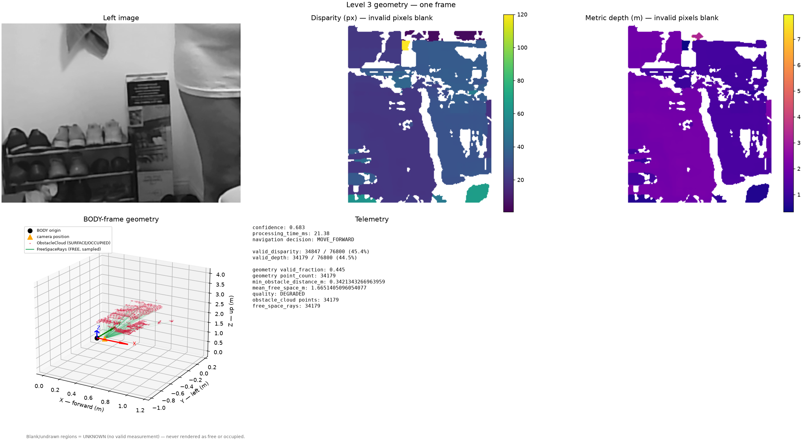
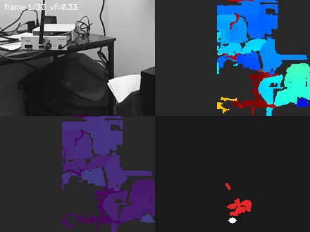

# Depth Perception Engine

A standalone, ROS-free stereo depth / traversability / obstacle perception
library. Geometry-only — no object detection, no learned models — designed
as the perception layer for a UAV navigating indoor environments.

Originally built and validated as a single hardware desk-test script; now
refactored into an installable library (`src/depth_perception_engine/`) so
it can be imported by MP-01's ROS2 `mp01_perception` package (or any other
caller) without dragging in ROS, camera hardware, or a GUI. The algorithms
themselves are unchanged from the validated desk-test version — this was a
structural refactor, not an algorithm rewrite.


## Refactor: before → after

The library was restructured from a single flat script into an installable
package. No algorithm, threshold, or tuned parameter changed — only where
the code lives and how it's called.

**Before** — one entry point, ten flat top-level folders, camera/GUI/disk
code mixed in with the algorithm, no tests, not installable:

```
depth_perception_engine/
├── main.py                       # camera + GUI + algorithm, all in one loop
├── stereo/                       # rectification.py had a hardcoded default XML path
├── depth/                        # depth_estimator.py duplicated rectification.py's
│                                  # calibration-loading code
├── perception/                   # name didn't describe what it did
├── fusion/threat_assessment.py   # actually obstacle detection, not fusion
├── navigation/velocity_planner.py
├── visualization/overlay_renderer.py
├── telemetry/run_logger.py
└── config/stereo_calibration.xml

no tests/, no pyproject.toml, not pip-installable
```

**After** — an installable package with a clear library/example boundary:

```
depth_perception_engine/
├── pyproject.toml                # pip install -e .
├── src/depth_perception_engine/
│   ├── calibration/               # new — one file-loading path, no hardcoded default
│   ├── stereo/
│   ├── depth/
│   ├── traversability/            # renamed from perception/ — matches what it does
│   ├── obstacles/                 # renamed from fusion/threat_assessment.py
│   ├── fusion/                    # new — result assembly + confidence scoring
│   ├── config/                    # new — PipelineConfig dataclass
│   ├── models/                    # new — typed results, no bare dicts
│   ├── utils/                     # new — shared validation/timing helpers
│   └── pipeline/                  # new — the public entry point
├── examples/
│   ├── live_demo.py               # was main.py
│   ├── synthetic_demo.py          # new — no camera, no GUI
│   ├── navigation/
│   ├── visualization/
│   └── telemetry/
└── tests/                          # new — 19 tests
```

Operations performed:

| # | Change |
|---|---|
| 1 | Extracted calibration file-loading into `calibration/`, removing duplicated `cv2.FileStorage` parsing from both `rectification.py` and `depth_estimator.py` |
| 2 | Removed the hardcoded default calibration path baked into `RectificationEngine` — every entry point now requires a `StereoCalibration` object passed in explicitly |
| 3 | Renamed `perception/` → `traversability/` and `fusion/threat_assessment.py` → `obstacles/` to match what each module actually computes |
| 4 | Wrapped every previously loose dict (`beams`, `scene`, distance measurements) in a typed dataclass: `DepthPerceptionResult`, `TraversabilityResult`, `ObstacleAssessment`, `BeamReading` |
| 5 | Added `PipelineConfig` — every tunable threshold that used to be a loose module-level constant in `main.py`, now one dataclass |
| 6 | Added `pipeline.DepthPerceptionPipeline` (stateful, holds engines across frames) and five stateless functions (`compute_disparity`, `estimate_depth`, `classify_traversability`, `detect_obstacles`, `process_stereo_pair`) as the public API |
| 7 | Moved camera capture, `cv2` GUI overlays, flight-command velocity planning, and disk telemetry logging into `examples/` — none of it is reachable from the library |
| 8 | Added `pyproject.toml` (src-layout, `opencv-python-headless` for the library core so it never pulls in a GUI-capable OpenCV build) |
| 9 | Added `tests/` (19 tests): every module imports cleanly, the pipeline builds and runs, every output is the documented structured type, and no `rclpy`/`sensor_msgs`/`cv_bridge`/camera/GUI dependency exists anywhere under `src/` |
| 10 | Added `docs/INTEGRATION_READINESS.md`, describing exactly how this library will be called from ROS2's `mp01_perception` package later |

| | Before | After |
|---|---|---|
| Entry point | `main.py`, one script | `pip install -e .` + `DepthPerceptionPipeline` |
| Lines (algorithm code) | 3,335, flat | 2,565 in `src/`, 1,206 in `examples/` |
| Tests | none | 19 |
| ROS/camera/GUI coupling | mixed into the algorithm modules | isolated to `examples/`, verified absent from `src/` |
| Calibration loading | duplicated, hardcoded default path | one function, no default, caller supplies the path |

## Install

```bash
python -m venv .venv && source .venv/bin/activate
pip install -e .              # library only — numpy + opencv-python-headless
pip install -e ".[dev]"       # + pytest/pytest-cov/pytest-mock, for running tests/
```

No camera, no display, and no ROS installation required for the library
itself. See [Running the examples](#running-the-examples) below for the
one extra step needed for the GUI demo.

## Development Setup

The canonical workflow for working on this repository — nothing beyond
these four commands is required on a fresh clone:

```bash
python3 -m venv .venv
source .venv/bin/activate
pip install --upgrade pip
pip install -e ".[dev]"
python -m pytest
```

`pip install -e ".[dev]"` installs the library in editable mode (src-layout
— edits under `src/depth_perception_engine/` are picked up immediately, no
reinstall needed) plus the full test toolchain: `pytest`, `pytest-cov`,
`pytest-mock`. `python -m pytest` then runs the full suite (162 tests as of
this writing) using this project's own `[tool.pytest.ini_options]`
configuration in `pyproject.toml` — no separate pytest config file, no
`PYTHONPATH` juggling required.

Other installable extras, same pattern:

```bash
pip install -e ".[docs]"      # reserved for a future docs build tool — currently installs nothing extra
pip install -e ".[all]"       # dev + docs together
```

Coverage is available on demand (not enabled by default, to keep a plain
`pytest` run's output uncluttered):

```bash
pytest --cov=depth_perception_engine
```

## Quick start

Every symbol below imports directly from the package root — this is the
canonical import style. Subpackage imports
(`from depth_perception_engine.pipeline import DepthPerceptionPipeline`)
still work as compatibility paths, but new code should use the top-level
form. Full API tier reference: [`docs/PUBLIC_API.md`](docs/PUBLIC_API.md).

```python
from depth_perception_engine import (
    DepthPerceptionPipeline,
    PipelineConfig,
    StereoObservation,
    load_stereo_calibration,
)

calibration = load_stereo_calibration("examples/config/stereo_calibration.xml")
pipeline = DepthPerceptionPipeline(PipelineConfig(), calibration)   # build once

result = pipeline.process(left_image, right_image)   # call per frame — both plain NumPy arrays
# or, if you're carrying a StereoObservation (e.g. with timestamps) instead
# of two loose arrays — an equivalent, not a different call shape:
observation = StereoObservation(left_image=left_image, right_image=right_image)
result = pipeline.process_observation(observation)

result.disparity_map          # float32 (H, W)
result.depth_map              # float32 (H, W), metres
result.valid_disparity_mask   # bool (H, W) — disparity_map > 0
result.valid_depth_mask       # bool (H, W) — depth_map > 0
result.traversability_mask    # TraversabilityResult: per-region grid + NavigationDecision
result.obstacles              # ObstacleAssessment: per-beam nearest-obstacle scan
result.confidence              # float, 0..1
result.processing_time_ms     # float
result.timestamp              # Optional[float] — only set if you pass left_timestamp/right_timestamp
result.geometry                # Optional[geometry.PointCloud] — None unless PipelineConfig(enable_geometry=True);
                                # camera-optical-frame (X right, Y down, Z forward) XYZ per pixel, metres,
                                # (H, W, 3) float32, NaN where invalid — see docs/DATA_CONTRACTS.md
result.geometry_body           # Optional[geometry.PointCloud] — None unless enable_geometry=True AND a
                                # body_T_camera_left extrinsic was passed to the pipeline; BODY frame
                                # (X forward, Y left, Z up), same shape/units/invalid convention as geometry
result.obstacle_cloud          # Optional[geometry.ObstacleCloud] — None unless enable_obstacle_geometry=True;
                                # unorganized (N, 3) float32, BODY frame, range-filtered valid surface points
result.free_space_rays         # Optional[geometry.FreeSpaceRays] — None unless enable_free_space_rays=True;
                                # one (origin, direction, range) ray per valid pixel — never fabricated for
                                # invalid/unknown pixels
result.geometry_metrics        # Optional[geometry.GeometryMetrics] — populated whenever geometry_body exists;
                                # valid_fraction, point_count, min_obstacle_distance_m, mean_free_space_m

pipeline.health()              # PipelineHealth: is_closed, frames_processed, last_confidence, ...
pipeline.reset()                # clears cross-frame smoothing state, keeps calibration/config
pipeline.close()                # marks the pipeline unusable; further process() calls raise
```

`from_config()` is also available as an alternate constructor, equivalent
to `DepthPerceptionPipeline(...)` above.

See [`examples/synthetic_demo.py`](examples/synthetic_demo.py) for this
same call shape run standalone (no camera), and
[`docs/INTEGRATION_READINESS.md`](docs/INTEGRATION_READINESS.md) for
exactly how MP-01's ROS2 `mp01_perception` package will call this later.

## Level 3: 3D geometry (frozen)

Beyond the Level 0-2 fields above, `DepthPerceptionPipeline` can optionally
produce full 3D geometric perception — metric depth turned into an actual
point cloud, transformed into the vehicle body frame, and reduced to
obstacle/free-space evidence with explicit unknown-space semantics. All of
it is opt-in (every flag defaults `False`/`None`) and purely additive to
the Level 0-2 fields above.

**What Level 3 includes:**
- Metric depth with explicit confidence/validity (Level 0-2, always on)
- Camera-optical-frame 3D point cloud (`result.geometry`)
- Body-frame 3D point cloud, via a calibrated extrinsic (`result.geometry_body`)
- Obstacle surface evidence (`result.obstacle_cloud`)
- Free-space ray evidence, terminating at observed surfaces, never behind them (`result.free_space_rays`)
- Explicit UNKNOWN-space preservation — invalid/unobserved regions are never rendered as free or occupied, anywhere in the chain
- Scalar geometry-quality metrics and an opt-in HEALTHY/DEGRADED/NO_USABLE_GEOMETRY classifier (`result.geometry_metrics`, `geometry.classify_geometry_quality`)

**What Level 3 explicitly does NOT include:** a persistent map, temporal
fusion across frames, IMU/motion compensation, a vehicle collision
envelope, collision-risk scoring, learned/neural stereo, semantic
perception, localization, or planning. See
[`docs/IMPLEMENTATION_STATUS.md`](docs/IMPLEMENTATION_STATUS.md) and
[`docs/E7_IMPLEMENTATION_PLAN.md`](docs/E7_IMPLEMENTATION_PLAN.md) for what
remains open beyond Level 3.

```python
from depth_perception_engine.frames import FrameId, RigidTransform

body_T_camera_left = RigidTransform(       # measured, calibrated extrinsic — see docs/COORDINATE_FRAMES.md
    rotation=..., translation=...,          # (3,3), (3,) — camera pose expressed in the body frame
    from_frame=FrameId.CAMERA_OPTICAL_LEFT, to_frame=FrameId.BODY,
)
config = PipelineConfig(enable_geometry=True, enable_obstacle_geometry=True, enable_free_space_rays=True)
pipeline = DepthPerceptionPipeline(config, calibration, body_T_camera_left=body_T_camera_left)
```

A standalone visual validation tool (outside the core engine — requires
`pip install -e ".[viz]"`) renders the left image, disparity, depth, and
BODY-frame geometry (with explicit axes) side by side:

```bash
pip install -e ".[viz]"
python examples/visualize_level3.py --live      # one real camera frame
```



Live demo (left image, disparity, metric depth, BODY-frame top-down geometry — all four panels are the real, unmodified `DepthPerceptionResult` from a live camera, reproduce with `python examples/generate_demo_gif.py`):



## Pipeline

```
(left_image, right_image) — already-split NumPy arrays, e.g. from ROS
  → rectify (calibrated)                     stereo.RectificationEngine
  → disparity (SGBM)                         stereo.DisparityEngine
  → depth estimation                          depth.DepthEstimator
  → 3D geometry (opt-in, camera frame only)   geometry.PointCloudBuilder
  → traversability grid + nav decision        traversability.SceneInterpreter
  → per-beam obstacle scan                    obstacles.ThreatAssessor
  → fused DepthPerceptionResult                fusion.result_builder
```

`pipeline.DepthPerceptionPipeline` wires all of the above and holds it
persistently across frames — this matters because `obstacles.ThreatAssessor`
EMA-smooths and debounces its output over time; rebuilding it every frame
throws that smoothing away. `pipeline.api` also exposes each stage as a
plain, stateless function (`compute_disparity`, `estimate_depth`,
`classify_traversability`, `detect_obstacles`, `process_stereo_pair`) for
one-shot use, scripting, or tests — see that module's docstring.

## Why geometry-only

Object detection (YOLO) was deliberately excluded, not just deferred as an
afterthought: obstacle avoidance only requires *where* something is, not
*what* it is, and the compute/power budget on the target hardware (NVIDIA
Jetson Orin Nano) is reserved for future VIO/SLAM work instead. See
Section 12 of [`docs/report.html`](docs/report.html) for the full reasoning.

## Project layout

```
src/depth_perception_engine/   the installable library — see below
tests/                         pytest suite: imports, pipeline, API, no-ROS-dependency proof
examples/                      runnable scripts + demo-only code (camera, GUI, flight-command
                                planning, disk telemetry) — none of this is part of the library
docs/                          architecture blueprint, diagrams, roadmap, integration readiness
runs/                          per-run telemetry from past examples/live_demo.py sessions
```

### `src/depth_perception_engine/`

| Module | Responsibility |
|---|---|
| `calibration/` | `StereoCalibration` data model + `load_stereo_calibration(path)` file loader. The **only** place in the library that touches a file path, and only when explicitly called. |
| `stereo/` | `FrameSplitter` (optional utility), `RectificationEngine`, `DisparityEngine` (SGBM) |
| `depth/` | `DepthEstimator` (disparity → metric depth via the calibration's Q matrix), `DistanceReader` (single-point ROI distance reading) |
| `traversability/` | `RegionAnalyzer` + `SceneInterpreter` — grid-based region classification and a global `NavigationDecision` |
| `obstacles/` | `ThreatAssessor` — per-beam nearest-obstacle scan, EMA-smoothed and debounced |
| `quality/` | `looks_like_garbage_frame` — adjacent-pixel correlation check that flags corrupt/uncorrelated-noise frames before any stereo processing runs |
| `fusion/` | Combines the above into one `DepthPerceptionResult`, including the aggregate `confidence` score |
| `config/` | `PipelineConfig` — every tunable threshold as one plain dataclass |
| `models/` | `DepthPerceptionResult`, `TraversabilityResult`, `ObstacleAssessment`, `BeamReading` — typed outputs, never bare dicts |
| `utils/` | Small shared helpers (input validation, timing) used by the pipeline glue, not by any one algorithm |
| `pipeline/` | `DepthPerceptionPipeline` (stateful, recommended) + the stateless `pipeline.api` functions |

No module under `src/` imports `rclpy`, `sensor_msgs`, or `cv_bridge`, opens
a camera device, or calls any `cv2.imshow`/`waitKey`/GUI function — enforced
by `tests/test_no_ros_dependency.py`, both by static source scan and by the
simple fact that this test environment doesn't have ROS installed at all.

### `examples/`

Everything here is a *consumer* of the library, never a dependency of it:

| File | What it needs beyond the library |
|---|---|
| `live_demo.py` | Real USB stereo camera, `cv2.imshow` (full `opencv-python`, not headless — see `pyproject.toml`'s comment on this) |
| `synthetic_demo.py` | Nothing — synthetic NumPy arrays, no camera, no GUI |
| `navigation/velocity_planner.py` | Converts obstacle beam data into forward speed / yaw rate — flight-command generation, downstream of and out of scope for the perception library itself |
| `visualization/overlay_renderer.py` | `cv2` drawing for `live_demo.py`'s on-screen display |
| `telemetry/run_logger.py` | Disk-based per-run logging (`runs/<timestamp>/`) for desk-test sessions |

## Running the examples

```bash
# No hardware needed:
python examples/synthetic_demo.py

# Real camera + on-screen display:
pip uninstall opencv-python-headless && pip install opencv-python
python examples/live_demo.py
```

`live_demo.py` requires a USB stereo camera presenting as a single
side-by-side 640×240 video device, and reads calibration from
`examples/config/stereo_calibration.xml`. Camera index is set at the top of
the file (`CAMERA_INDEX`) — verify with `v4l2-ctl --list-devices` if
obstacle distances look wrong (e.g. picking up a laptop webcam instead of
the stereo rig). Controls while running: `q` to quit, `d` to toggle the
disparity view, `g` to toggle the traversability grid overlay. Each run
logs config, system info, and per-frame telemetry to `runs/<timestamp>/`.

## Testing

```bash
pip install -e ".[dev]"
pytest tests/ -v
```

162 tests (grew from the 19 the src/ refactor above originally added,
through a 2026-08-05 baseline-recovery pass and a Level 3 Phase E1
contract-freezing pass — see `docs/VALIDATION_REPORT.md` and
`docs/LEVEL3_ARCHITECTURE.md`): every module imports cleanly,
`DepthPerceptionPipeline` can be built and `.process()`d (including
repeated calls, its full lifecycle — `reset()`/`close()`/`health()` — and
rejecting mismatched stereo pairs), every output field is the documented
structured type (never a bare dict), depth math is verified both
differentially against OpenCV and against independent hand-computed known
values, the new Level 3 calibration/geometry contracts construct and
validate correctly (though nothing produces a real point cloud yet — see
`docs/IMPLEMENTATION_STATUS.md`), and — the requirement this whole
refactor exists for — no ROS dependency exists anywhere in the library.
See `docs/ARCHITECTURE.md`,
`docs/DATA_CONTRACTS.md`, and `docs/CALIBRATION.md` for the full module
boundaries, output contracts, and calibration conventions;
`docs/IMPLEMENTATION_STATUS.md` for what's implemented versus deferred;
`docs/PUBLIC_API.md` for the authoritative Tier 1/2/3 API reference and
stability policy.

## Status

Rectification, disparity, depth estimation, obstacle beams, and the
traversability grid are validated on real hardware and now packaged as an
installable library (this refactor). `examples/live_demo.py` additionally
wires in a reactive velocity planner for standalone desk-testing, though
flight-command generation is intentionally *not* part of the library's own
scope — see [`docs/INTEGRATION_READINESS.md`](docs/INTEGRATION_READINESS.md).
IMU, VIO/SLAM, lidar fusion, and the rover stack are planned but not yet
implemented — see the status table in `docs/report.html` for the full
breakdown.

## License

[MIT](LICENSE)
